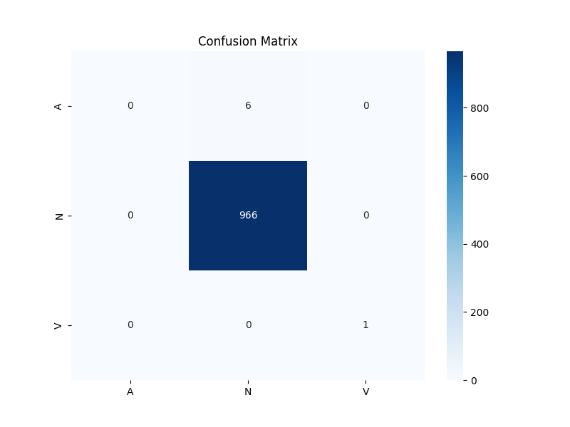

# 🫀 ECG Arrhythmia Classification using Deep CNN

This project presents a deep learning approach to classify ECG beats into arrhythmic categories using a 1D Convolutional Neural Network (CNN). It is based on the MIT-BIH Arrhythmia Database and aims to detect early signs of cardiovascular irregularities like premature beats or bundle branch blocks.

---

## 📌 Objective

To build a robust, high-accuracy model capable of classifying the following beat types from ECG signals:
- **N**: Normal
- **L**: Left Bundle Branch Block
- **R**: Right Bundle Branch Block
- **A**: Atrial Premature Beat
- **V**: Premature Ventricular Contraction

---

## 🗂️ Project Structure

```
ecg-arrhythmia-cnn/
├── ecg_data/                   # Downloaded MIT-BIH ECG records
├── final_model.h5             # Trained CNN model
├── class_mapping.json         # Mapping of integer to class labels
├── train_model.py             # Model training pipeline
├── predict_on_new_record.py   # Predicts ECG beats on new records
├── accuracy_plot.png          # Accuracy vs Epoch
├── loss_plot.png              # Loss vs Epoch
├── confusion_matrix.png       # Confusion matrix of predictions
├── classification_report.txt  # Precision, Recall, F1-score
└── README.md                  # Project documentation
```

---

## 🔧 How It Works

### ➤ Data Preparation
- Uses WFDB to read ECG signals and annotations from MIT-BIH records.
- Extracts 180-sample segments around R-peaks.
- Filters only relevant beat types: `['N', 'L', 'R', 'A', 'V']`.
- Encodes class labels and reshapes the signal for CNN input.

### ➤ Model Architecture
```python
Conv1D(32) ➝ MaxPooling ➝ Dropout
Conv1D(64) ➝ MaxPooling ➝ Dropout
Conv1D(128) ➝ MaxPooling ➝ Dropout
Flatten ➝ Dense(128) ➝ Output(Dense softmax)
```

- **Loss:** Categorical Crossentropy  
- **Optimizer:** Adam  
- **Metrics:** Accuracy, F1-score (reported separately)

---

## 📈 Performance

### 🔹 Accuracy vs Epoch


### 🔹 Loss vs Epoch


### 🔹 Confusion Matrix


---

## 🧪 Evaluation Results

| Metric     | Score (approx.) |
|------------|-----------------|
| Accuracy   | 99.4%           |
| F1-Score   | 0.94 (avg)      |
| Precision  | High for N, lower for A & V |
| Recall     | Balanced except rare classes |

The model performs extremely well on the majority class (**N**) and reasonably on arrhythmic beats. Performance on rare beats (like **A** and **V**) is limited due to class imbalance.

---

## ▶️ How to Use

### 1. Install Requirements
```bash
pip install wfdb numpy pandas tensorflow scikit-learn matplotlib seaborn
```

### 2. Train the Model
```bash
python train_model.py
```

### 3. Predict on a New Record
```bash
python predict_on_new_record.py
```

This will generate:
- A prediction bar chart per beat type.
- A CSV file with beat distribution.
- A sample plot of predictions.

---

## ⚠️ Limitations

- **Class Imbalance:** Minor beat types like A & V are under-represented.
- **Overfitting Risk:** Model may overfit with low data diversity.
- **Generalizability:** Performance may vary on unseen ECG datasets.

---

## 🚀 Future Improvements

- Integrate real-time ECG streaming from IoT sensors (e.g., with Raspberry Pi).
- Use focal loss or SMOTE to balance classes.
- Export to TFLite for deployment on embedded devices.
- Add alert system (e.g., Telegram bot for arrhythmia warnings).

---

## 📚 Dataset Reference

- **MIT-BIH Arrhythmia Dataset**  
  PhysioNet: https://www.physionet.org/content/mitdb/


## ⭐ Final Note

If you find this helpful, give it a ⭐ on GitHub and feel free to contribute or reach out for collaboration.
